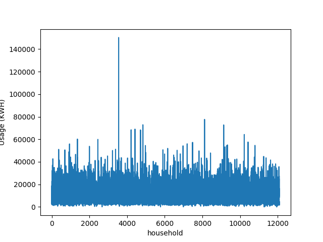
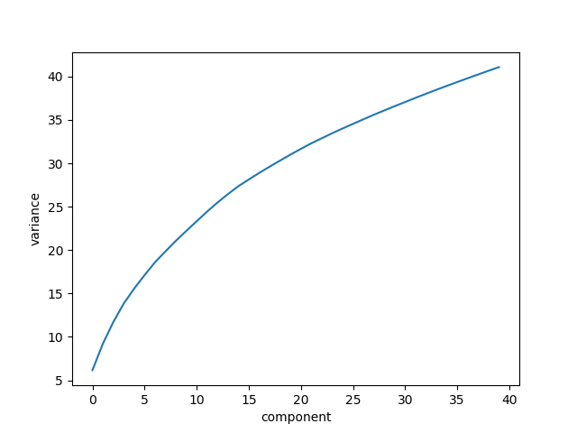

---

The Residential Energy Consumption Survey is a national survey that collects energy-related data for housing units. Data was collected from 12,083 households selected at random, and contains hundreds of factors as well as associated measures of energy usage. More information about the dataset can be obtained [here](https://www.eia.gov/consumption/residential/data/2009/index.php?view=microdata).

Principle Component Analysis (PCA) was utilized to find uncorrelated components within the dataset and to reduce the dimensionality along combinations of the dataset. Linear regression was conducted on normalized data to find the features that correlated the most with energy usage.


## Principal Component Analysis
### An investigation of independence among parameters





## Regression Analysis
### An investigation of correlation among parameters

```{r echo=FALSE, comment=NA}
packages <- function(packages) {
  for (package in packages) {
    if (!require(package, character.only = TRUE, quietly = TRUE)) {
      # install package if not detected
      install.packages(pkgs = package, repos = "http://cran.r-project.org", 
                       quiet = TRUE)
      require(package, character.only = TRUE)
    }
  }
}

printString <- function(string) {
  delimitedString <- paste(string, "\n", collapse = "\n")
  cat(delimitedString)
}

printNewline <- function(numberOfLines) {
  for (i in seq(from = 0, to = numberOfLines - 1, by = 1)) {
    printString("")
  }
}

packages(c("formatR", "car"))  # require packages

library(formatR)  # load formatting library
# tidy_dir(path = ".", recursive = TRUE)  # format files

color <- "steelblue3"
```

```{r echo=FALSE, comment=NA}
data <- read.csv("../data/recs2009_public.csv", header = TRUE)
correlationRanking <- data.frame(name = character(), rsquared = double(), lambda = double(), isFactor = logical(), stringsAsFactors = FALSE)
```

Correlation between explanatory variables and response:

```{r echo=FALSE, comment=NA}
regressions <- list()  # to store all regressions

# iterate over all variables
for (variable in names(data)) {
  regression <- list()
  regression$variable <- variable
  regression$x <- data[[regression$variable]]
  regression$isFactor <- FALSE
  regression$uniqueValues <- length(unique(regression$x))
  if (regression$uniqueValues < 2) {
    # not enough unique factors to continue, skip
    next
  } else if (regression$uniqueValues < 100) {
    # most likely a categorical variable
    regression$isFactor <- TRUE
    regression$x <- as.factor(regression$x)
  }
  regression$y <- data$KWH  # response variable
  regression$formula <- regression$y ~ regression$x
  regression$lm <- lm(regression$formula)
  regression$boxcox <- boxCox(object = regression$lm, plotit = FALSE)
  regression$lambda <- regression$boxcox$x[which.max(regression$boxcox$y)]  # account for deviances in the normality of the errors
  regression$y <- yjPower(regression$y, lambda = regression$lambda)  ## transform data based on calculated lambda value
  regression$formula <- regression$y ~ regression$x
  regression$lm <- lm(regression$formula)
  regression$rsquared <- summary(regression$lm)$r.squared
  regression$confint <- confint(object = regression$lm, level = 0.9)
  regression$aov <- aov(regression$formula)
  regression$resid <- resid(regression$lm)
  regression$fitted <- fitted(regression$lm)
  regression$mse <- sum(regression$resid^2)/(length(regression$x) - 2)

  regressions <- append(regressions, list(regression))

  if (!is.null(regression$rsquared)) {
    # add to ranking of r-squared values
    correlationRanking <- rbind(correlationRanking, data.frame(name = variable, rsquared = regression$rsquared, lambda = regression$lambda, isfactor = regression$isFactor))
    correlationRanking <- correlationRanking[order(correlationRanking$rsquared, decreasing = TRUE), ]
  }
}

print(correlationRanking)  # print ranking of most correlated variables
```

Regression analysis for each feature:

```{r echo=FALSE, comment=NA}
for (i in 1 : length(regressions)) {
  regression = regressions[[1]]
  summary(regression)
  printString(paste("Analysis of Explanatory Variable:", regression$variable))
  printNewline(1)
  printString(paste("Categorical:", regression$isFactor))
  printNewline(1)

  printString("Linear Model:")
  print(summary(regression$lm))

  printString("Confidence Interval:")
  print(regression$confint)
  printNewline(1)

  printString("Analysis of Variance:")
  print(summary(regression$aov))
  printNewline(1)

  printString("Residuals:")
  print(summary(regression$resid))
  printNewline(1)

  printString(paste("MSE:", regression$mse))

  # regression line plot
  plot(x = regression$x, y = regression$y, xlab = regression$variable, ylab = "KWH", 
       main = "Regression Function", col = color)
  if (!regression$isFactor) {
    abline(regression$lm, col = color)
  }

  # residual and normal probability plots
  plot(x = regression$fitted, y = regression$resid, xlab = "Fitted Values", ylab = "Residuals", 
       main = "Residual Plot", col = color)
  qqnorm(regression$resid, main = "Normal Probability Plot", col = color)
  qqline(regression$resid, col = color)
}
```

